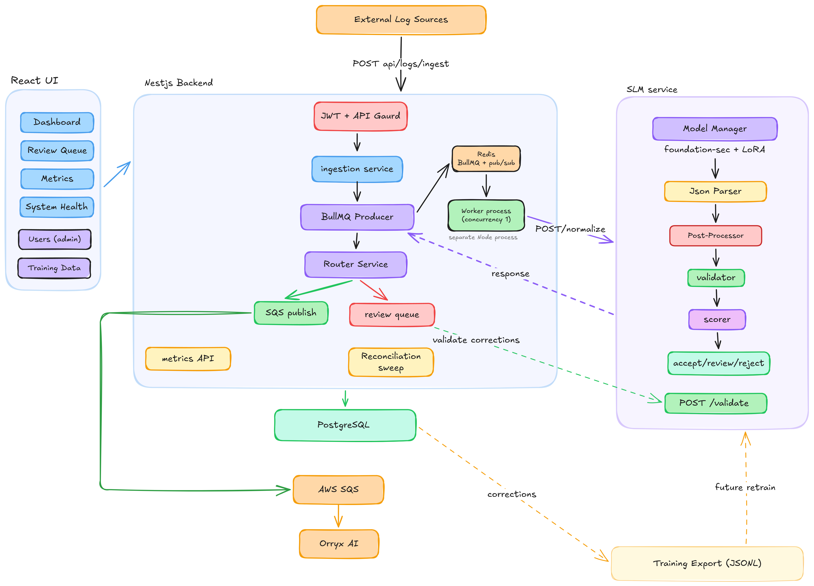

# Log Normalizer

> Fine-tuned LLM pipeline that converts multi-vendor security alerts into OCSF v1.7.0 Detection Finding JSON, with deterministic post-processing and a human-in-the-loop correction queue.

LogNormalizer replaces manual parser development for new SIEM and endpoint sources. Instead of writing a vendor-specific adapter every time a schema changes, raw alerts are submitted to a single endpoint and receives validated OCSF Detection Findings. Analyst corrections feed back into a training data export so the underlying model can be improved over time.

---

## What it does

1. A raw security alert (Splunk, CrowdStrike, Microsoft Defender, Microsoft Sentinel, Palo Alto Networks, Trend Micro, LogRhythm, or Expel) is submitted via HTTP.
2. The system enqueues it, runs it through a fine-tuned Small Language Model (SLM), validates the output against the official OCSF v1.7.0 schema, runs a deterministic post-processor to fix structural bugs and strip hallucinations, scores confidence, and decides whether to publish the result automatically or route it to a human review queue.
3. Analysts reviewing flagged jobs can edit the OCSF output. Their corrections are republished downstream as new OCSF events that supersede the original.
4. Analysts can also browse all completed jobs and flag any one they think is wrong, even if the model auto-accepted it. Same correction-and-republish flow.
5. Admins can export all reviewer corrections as JSONL training data for future fine-tuning runs.
6. Accepted OCSF events are persisted and published downstream to the SOC platform via SQS.

The model is fine-tuned from Foundation-Sec-1.1-8B-Instruct on a hand-labeled training set. The SLM alone is not reliable enough for production use - the system is designed around that reality. The post-processor is a deterministic safety layer that catches the model's known failure modes. Confidence-based routing means low-confidence outputs are never published without a human seeing them first. The human-initiated correction loop catches the cases the model gets confidently wrong.

---

## Architecture at a glance



The system has **three code services** plus **three infrastructure dependencies**. The backend runs as **two separate Node processes** (HTTP + worker) from the same built image - this is the most important thing to understand about the deployment model.

| Service                  | Role                                                                  | Language                  | Deploy                       |
| ------------------------ | --------------------------------------------------------------------- | ------------------------- | ---------------------------- |
| `log-normalizer-backend` | HTTP API, auth, job orchestration, BullMQ worker, DB access           | TypeScript (NestJS)       | Two processes: HTTP + worker |
| `log-normalizer-slm`     | Model inference, OCSF validation, post-processing, confidence scoring | Python 3.11 (FastAPI)     | Single process, GPU required |
| `log-normalizer-ui`      | Monitoring dashboard, review queue UI, admin pages                    | TypeScript (React + Vite) | nginx-served static build    |

| Infrastructure | Used for                                                                | Required       |
| -------------- | ----------------------------------------------------------------------- | -------------- |
| PostgreSQL     | Source of truth for jobs, users, reviews, OCSF events, training exports | Yes            |
| Redis          | BullMQ queue and BullMQ QueueEvents (cross-process job state sync)      | Yes            |
| AWS SQS        | Downstream publish of accepted OCSF events to the SOC platform          | Optional (dev) |

---

## Quick start

The fastest way to run the whole stack is Docker Compose. Requirements on the host:

- Docker 24+ with Compose v2 (`docker compose`, not `docker-compose`)
- ~10 GB free disk for the SLM model weights
- Optional: NVIDIA GPU with `nvidia-container-toolkit` installed (the SLM falls back to CPU but inference will be unusably slow - minutes per alert)

From the repo root:

```bash
# 1. Copy the per-service example envs and fill in real secrets.
#    Each service owns its own .env - there is no root .env.
cp log-normalizer-backend/.env.example log-normalizer-backend/.env
cp log-normalizer-slm/.env.example     log-normalizer-slm/.env
cp log-normalizer-ui/.env.example      log-normalizer-ui/.env
$EDITOR log-normalizer-backend/.env    # set API_KEY, JWT_SECRET, BOOTSTRAP_ADMIN_* at minimum

# 2. Boot the stack
docker compose up -d

# 3. Watch the logs while everything starts
docker compose logs -f

```

First boot takes 3-5 minutes because the SLM downloads the base model weights the first time. Subsequent boots are much faster - the model is cached in a named volume.

Log in with the bootstrap admin email and password from your `.env`.

---

## Prerequisites

For running the full stack via Docker Compose:

- Docker 24+ with Compose v2
- ~10 GB disk for model weights
- GPU strongly recommended for realistic inference times

For local development without Docker (recommended when iterating on a single service):

- Node.js 22.x
- Python 3.11
- PostgreSQL 16
- Redis 7
- npm (the backend and UI both use npm)
- `concurrently` is installed as a backend devDependency to run HTTP + worker in parallel during dev

---

## Repository layout

```
log-normalizer/
├── docker-compose.yml          # production stack
├── docker-compose.override.yml # dev overrides (bind mounts, HMR)
│
├── log-normalizer-backend/     # NestJS: HTTP + worker + DB + auth
│   ├── src/
│   ├── prisma/schema.prisma
│   ├── test/unit/
│   ├── test/e2e/
│   ├── Dockerfile
│   └── README.md               # ← backend deep dive
│
├── log-normalizer-slm/         # FastAPI: inference + post-processing
│   ├── app/
│   │   ├── api/                # HTTP routes
│   │   ├── models/             # model loader + inference wrapper
│   │   ├── ocsf/               # OCSF Pydantic models + enums + validator
│   │   ├── postprocess/        # 17-rule post-processor
│   │   ├── scoring/            # confidence scoring
│   │   └── utils/              # prompt builder, JSON extraction
│   ├── tests/unit/
│   ├── Dockerfile
│   └── README.md               # ← SLM deep dive
│
└── log-normalizer-ui/          # React + Vite
    ├── src/
    │   ├── pages/
    │   ├── components/
    │   ├── context/            # AuthContext
    │   └── api/
    ├── Dockerfile
    └── README.md               # ← UI deep dive
```

---

## Core data flow

### Auto-accept path

When a raw alert arrives via `POST /api/logs/ingest`:

1. **IngestionService** creates a `NormalizeJob` row in Postgres with `status = QUEUED`. If the request carried an `Idempotency-Key` header matching an existing row, the existing job is returned instead (deduplication).
2. **NormalizeProducer** enqueues a BullMQ job using the new row's UUID as the BullMQ job ID. One identity, not two. If the enqueue fails, the DB row is rolled back.
3. The API returns `202 Accepted` with `{ jobId, status: "queued" }`.
4. The **worker process** (separate Node process) pulls the job from Redis. It runs at `concurrency: 1` - only one inference in flight at any time because the GPU is batch-1.
5. **NormalizeProcessor.process** marks the row `ACTIVE` via an atomic `updateMany` (the `WHERE status IN (QUEUED, ACTIVE)` guard makes this retry-safe), then calls the SLM service over HTTP.
6. The **SLM service** runs the inference, extracts the JSON from the model output, runs the **post-processor** (17 deterministic rules across 5 stages), validates against Pydantic OCSF models, and computes a confidence score that gets docked for any hallucinations the post-processor had to strip.
7. The worker receives the cleaned OCSF, the confidence score, the `fixes_applied` list, and the `hallucinations_stripped` list.
8. **RoutingService** decides what happens next based on the confidence decision:
   - `accept`: creates an `OCSFEvent` row, creates a `ProcessingMetric` row, publishes the OCSF event to SQS, and the job is marked `COMPLETED`.
   - `review`: creates a `ManualReview` row with `correctionType = AUTO_FLAGGED`, no SQS publish, and the job is still marked `COMPLETED` (the review queue is a signal, not a job state).
   - `reject`: the job is marked `FAILED` with the validation error.
9. The worker calls `JobsService.markCompleted` with the full payload including `fixesApplied` and `hallucinationsStripped`.
10. BullMQ emits a `completed` event. The HTTP process (separate Node process, separate memory space) receives it via a **BullMQ QueueEvents listener** that uses Redis pub/sub. SSE clients watching that `jobId` receive the final state and the connection closes.

**The contract that matters most:** `status === COMPLETED` implies the `OCSFEvent`, `ProcessingMetric`, and any required `ManualReview` rows exist for that job. Routing runs _before_ `markCompleted`, not after, so a consumer reading a `COMPLETED` job can always join to the downstream rows without a race.

### Review and correction path

For jobs that landed in the review queue (either auto-flagged by confidence routing or human-flagged via the browse jobs page):

1. An analyst opens the job in the UI, sees the raw alert side-by-side with the OCSF output and the list of fixes the post-processor applied, edits the OCSF JSON if needed, and submits the correction.
2. **ReviewService.submitCorrection** runs in a single Postgres transaction:
   - Stores the corrected OCSF, the reviewer email (sourced from the JWT), and the submission timestamp on the `ManualReview` row.
   - Inserts a **new** `OCSFEvent` row with the corrected payload, linked back to the original via `supersedesEventId`.
   - Updates the original `OCSFEvent` to point to the new one via `supersededById`.
3. After the transaction commits, the new event is published to SQS with message attributes `IsCorrection=true`, `SupersedesEventId=<old uuid>`, and `ManualReviewId=<review uuid>` so downstream consumers can identify it as a correction. SQS publish failures are logged but do not roll back the DB transaction - the database is the source of truth.
4. The "current" OCSF event for any job is the one with `supersededById IS NULL`. The supersedes chain is queryable for full audit history.

### Human-initiated flag

Any analyst can browse all completed jobs at `/jobs` and click "Flag for review" on a job they think the model got wrong. This creates a `ManualReview` row with `correctionType = HUMAN_FLAGGED` and `flaggedById = <user.id>`, then redirects to the same review detail page used for auto-flagged jobs. From there the correction-and-republish flow is identical.

### Training data export

Admins can export all reviewer corrections as JSONL training data from the admin training data page. Each export is recorded as a `TrainingExport` row with the admin who triggered it and the record count. Corrections that were included in a past export are marked via the `ManualReview.trainingExportId` foreign key, so re-exports never include the same data twice.

---

## Key concepts

### OCSF

[OCSF](https://ocsf.io) is the Open Cybersecurity Schema Framework - a vendor-neutral schema for security events. This project targets **OCSF v1.7.0**, specifically the **Detection Finding** event class (`class_uid: 2004`). The Pydantic models under `log-normalizer-slm/app/ocsf/` are hand-derived from the official schema at `schema.ocsf.io/1.7.0`. They use `extra="ignore"` so any field the model invents that doesn't exist in the official schema is silently dropped during validation.

The system prompt passed to the SLM explicitly references OCSF v1.7.0 and includes the rules the model is supposed to follow.

### Confidence routing

Every normalized output gets a composite confidence score in `[0, 1]`. The score is broken down into four components:

- `schema_score` - how cleanly the output validated against the OCSF Pydantic models (1.0 = valid, docks for each hard error and each warning).
- `coverage_score` - what fraction of SOC-useful fields the model actually populated.
- `consistency_score` - a heuristic check that related fields agree (e.g., `type_uid` matches `class_uid * 100 + activity_id`).
- `post_process_penalty` - a _negative_ value that docks the score by 0.10 for each hallucination the post-processor had to strip, capped at -0.30.

The composite is then compared to thresholds to produce a **decision**:

- `accept` - publish downstream, no human needed.
- `review` - route to the manual review queue.
- `reject` - validation failed too hard, mark the job `FAILED`.

**VERIFY**: exact threshold values in log-normalizer-slm/app/scoring/confidence.py

### Post-processor

The model has predictable failure modes. The post-processor is a deterministic safety layer that runs between the model's JSON output and the OCSF validator. It has 17 rules across 5 stages:

1. **Structural** - relocate misplaced fields (e.g., `severity_id` nested inside `finding_info`), fix evidence network nesting, move `device.account` to `device.owner.account`, strip invented metadata fields.
2. **Type / value fixes** - correct observable `type_id` values using a lookup table, coerce `email.to` to a list, flatten `email.from` from an object to a string, drop `process.pid` when it's a non-numeric string, strip `device.os` when it's a string instead of an object.
3. **Enrichment** - force `metadata.version = "1.7.0"`, set `metadata.product.vendor_name` from the source parameter, and enrich email evidence with real metadata from the raw alert (sender IP, SPF/DKIM/DMARC results, message IDs).
4. **MITRE lookup** - use a minimal table of MITRE ATT&CK techniques and tactics to correct hallucinated names and normalize deprecated tactic names (TA0043 PreAttack → Reconnaissance).
5. **Hallucination guards** - strip hallucinated MITRE attacks on alerts that contain zero MITRE references, strip hallucinated OS strings when the raw alert has no OS keywords, and strip `device.hostname` values that look like emails or don't appear anywhere in the raw alert.

Every rule logs what it did. The full list of fixes and stripped hallucinations is persisted on the `NormalizeJob` row and returned in the API response, so a human reviewing a flagged job can see exactly what the post-processor changed.

See `log-normalizer-slm/README.md` for the full rule list.

### Review queue and corrections

Jobs land in the review queue in two ways:

- **Auto-flagged** (`correctionType = AUTO_FLAGGED`) - confidence routing decided the output was uncertain.
- **Human-flagged** (`correctionType = HUMAN_FLAGGED`) - an analyst browsing the jobs page clicked "Flag for review" on a job the model auto-accepted.

Both end up at the same `/review/:id` detail page with the same edit flow. Submitting a correction is the same code path either way.

Reviewer identity is sourced from the JWT, never from the request body. This prevents impersonation.

### OCSFEvent supersedes chain

A correction does not modify the original `OCSFEvent`. It inserts a new row with `supersedesEventId` pointing back to the original, and the original's `supersededById` is updated to point forward to the new row. Multiple corrections form a chain. The "current" event for any job is the one whose `supersededById IS NULL`. The full history is queryable.

The unique constraint on `OCSFEvent.normalizeJobId` is intentionally not present. Multiple events per job is the normal case once corrections exist.

### Training data export

Admins can export reviewer corrections as JSONL training data from `/admin/training-data`. The export format matches the shape of the original `train.jsonl` the SLM was fine-tuned on:

```json
{
  "messages": [
    {
      "role": "system",
      "content": "<the exact system prompt used by the SLM>"
    },
    {
      "role": "user",
      "content": "Normalize this splunk security alert to OCSF Detection Finding format.\n\n<raw_log>"
    },
    { "role": "assistant", "content": "<corrected_ocsf>" }
  ]
}
```

Each export is recorded as a `TrainingExport` row with the admin who triggered it and the record count. The `ManualReview.trainingExportId` foreign key tracks which corrections have already been exported.

**Important:** the system prompt in the exported JSONL is hardcoded in the backend as a constant. If you change the SLM's system prompt, also update the backend constant - otherwise future fine-tuning runs will train against a different prompt than inference uses, which breaks the model subtly. There is a unit test that asserts the constant starts with the expected prefix as a minimum drift detector, but it cannot catch deeper changes. Treat this as a permanent cross-service invariant.

---

## Authentication

Two authentication shapes coexist:

- **JWT cookie sessions** for humans (UI users). Login at `POST /api/auth/login`, credentials hashed with argon2id, token stored in an `httpOnly; SameSite=Strict` cookie, 24-hour expiry, no refresh tokens.
- **API keys** for machines (SIEM ingestion). A single shared API key from env.

Routes are gated by one of three guards:

- `JwtAuthGuard` - JWT only, used by UI-driven endpoints.
- `ApiKeyAuthGuard` - API key only, used by machine ingestion.
- `JwtOrApiKeyAuthGuard` - either one, used by read endpoints that both populations call.

Two roles: `ANALYST` and `ADMIN`. The `@Roles(UserRole.ADMIN)` decorator + `RolesGuard` gate admin-only routes (user management, training data export).

A bootstrap admin is created on first boot using `BOOTSTRAP_ADMIN_EMAIL` and `BOOTSTRAP_ADMIN_PASSWORD` from env. The bootstrap is idempotent - running it twice does nothing.

See the backend `README.md` for the full route-by-route auth matrix.

---

## Environment variables

Environment is loaded per service via Docker Compose `env_file:` directives. Each service directory has its own `.env.example` - copy to `.env` and fill in real values. There is **no** root `.env`.

- `log-normalizer-backend/.env` - Postgres, Redis, auth, SQS, circuit breaker, reconciliation. Also consumed by the `postgres` and `migrate` services.
- `log-normalizer-slm/.env` - Model paths, device, confidence thresholds.
- `log-normalizer-ui/.env` - `VITE_API_URL` only

The critical variables:

| Variable                                                   | Purpose                                                                                                                                                            | Required                         |
| ---------------------------------------------------------- | ------------------------------------------------------------------------------------------------------------------------------------------------------------------ | -------------------------------- |
| `DATABASE_URL`                                             | Postgres connection string                                                                                                                                         | Yes                              |
| `REDIS_URL`                                                | Redis connection string for BullMQ + QueueEvents                                                                                                                   | Yes                              |
| `SLM_API`                                                  | Internal URL the backend uses to reach the SLM service (e.g., `http://slm:8000`)                                                                                   | Yes                              |
| `JWT_SECRET`                                               | HMAC secret for signing JWTs. **Set this to a strong random value.**                                                                                               | Yes                              |
| `API_KEY`                                                  | Shared API key for machine ingestion. **Set this to a strong random value.**                                                                                       | Yes                              |
| `BOOTSTRAP_ADMIN_EMAIL`                                    | Email of the bootstrap admin created on first boot                                                                                                                 | Yes                              |
| `BOOTSTRAP_ADMIN_PASSWORD`                                 | Password of the bootstrap admin (argon2-hashed on insert)                                                                                                          | Yes                              |
| `TIMEOUT`                                                  | Opossum circuit breaker timeout for the SLM HTTP call, in milliseconds. Must be longer than realistic SLM inference time - current default is 860000 (~14 minutes) | Yes                              |
| `SQS_QUEUE_URL`                                            | AWS SQS queue URL for publishing accepted OCSF events downstream                                                                                                   | No (publish is skipped if unset) |
| `AWS_REGION`, `AWS_ACCESS_KEY_ID`, `AWS_SECRET_ACCESS_KEY` | AWS credentials for SQS                                                                                                                                            | Only if `SQS_QUEUE_URL` set      |
| `VITE_API_URL`                                             | UI-side API base URL (e.g., `http://localhost:3000/api` or `/api` with nginx proxy)                                                                                | Yes (UI)                         |

Secrets are loaded via `env_file:` directives in `docker-compose.yml`, not via `${VAR}` substitution. If a required variable is missing, the backend process will fail at startup with a validation error - the failure is enforced in application code, not at the Compose level.

---

## Development workflow

The three services can be developed independently.

**Backend:**

```bash
cd log-normalizer-backend
npm install
npx prisma migrate dev         # applies schema to a local Postgres
npm run dev                    # runs HTTP + worker in parallel via concurrently
npm test                       # unit suites
npm run test:e2e               # e2e requires real Postgres + Redis
```

**SLM:**

```bash
cd log-normalizer-slm
python -m venv .venv && source .venv/Scripts/Activate
pip install -r requirements.txt
uvicorn app.main:app --reload  # [VERIFY: exact command]
pytest tests/unit
```

**UI:**

```bash
cd log-normalizer-ui
npm install
npm run dev                    # Vite dev server with HMR
```

When you need the full stack running, use Docker Compose with the dev override file, which bind-mounts your source into each container and enables hot reload.

---

## Testing

Tests are organized into three layers:

| Layer               | Location                            | Command            | Notes                                                                     |
| ------------------- | ----------------------------------- | ------------------ | ------------------------------------------------------------------------- |
| Backend unit        | `log-normalizer-backend/test/unit/` | `npm test`         | Mocked dependencies                                                       |
| Backend integration | same (specs using real Postgres)    | `npm test`         | Uses a test database                                                      |
| Backend e2e         | `log-normalizer-backend/test/e2e/`  | `npm run test:e2e` | Real Postgres + Redis + BullMQ, mocked SLM + SQS                          |
| SLM unit            | `log-normalizer-slm/tests/unit/`    | `pytest`           | Includes fixture tests for the post-processor against real broken outputs |

**The e2e suite catches module wiring bugs that unit tests cannot.** Unit tests use `Test.createTestingModule({ providers: [...] })` which bypasses the module graph entirely, so problems like a forgotten module import or a misconfigured `ConfigModule.forRoot()` only surface in e2e. Do not skip the e2e suite - run both layers before every release.

---

## Deployment notes

The system is containerized and runs cleanly via `docker compose up`. A few things worth knowing:

- **The backend image builds once and is used for three different commands:** HTTP API (`node dist/src/main`), worker (`node dist/src/worker`), and migrations (`npx prisma migrate deploy`). The compose file runs migrations as a dedicated one-shot service that exits on success, and both long-running backend services `depends_on: { condition: service_completed_successfully }` on the migration service. This eliminates race conditions during startup when scaling the backend horizontally.
- **The SLM container requires GPU passthrough** via `deploy.resources.reservations.devices` with the NVIDIA runtime. Without a GPU, inference is unusable (minutes per request). Document the `nvidia-container-toolkit` host prerequisite when handing this off.
- **The worker process is a separate container**, not embedded in the HTTP container. This is deliberate - a worker crash doesn't take down the HTTP API, and you can scale them independently if needed. Both containers run the same image with different `CMD` overrides.
- **Cross-process job state sync** between the HTTP process and the worker process uses BullMQ's `QueueEvents` class, which is built on Redis pub/sub. This works correctly for single-backend deployments. Scaling the HTTP process to multiple instances requires additional work on SSE connection affinity (currently untested).

---

## What the system does not do

Things to be aware of when extending the project:

- **No refresh tokens, password reset, email verification, account lockout, or 2FA** on the auth system. JWT expiry is 24 hours with no renewal; users re-login each day.
- **Standard SQS queue, not FIFO.** The publish code supports FIFO (with deduplication IDs based on `normalizeJobId`) but the current deployment uses a standard queue. FIFO support is a queue URL change, not a code change.
- **Multi-instance backend is untested.** The SSE implementation uses Redis pub/sub via BullMQ QueueEvents, which should work across multiple HTTP instances in theory. If you scale horizontally, test SSE specifically.
- **Model hallucinations remain.** The post-processor catches the _known_ failure modes (hallucinated MITRE, hostname-is-email, fabricated OS strings, wrong observable type IDs). Novel hallucinations on alert shapes the model hasn't seen before will still get through. The confidence-based routing and the human-initiated flag-for-review path are the second and third lines of defense.
- **No diff view between original and corrected OCSF** on the review detail page. The full original is still visible because the supersedes chain preserves it in the database, but rendering a side-by-side diff is a UI improvement that hasn't been built.
- **Reconciliation sweep is the safety net** for jobs stuck in `ACTIVE` (worker crashed mid-inference) or stuck in `QUEUED` with no matching BullMQ entry. It runs every 5 minutes. See the backend `README.md` for details.

---

## Glossary

- **OCSF** - Open Cybersecurity Schema Framework. Vendor-neutral schema for security events. Targeted version here is 1.7.0.
- **Detection Finding** - The OCSF event class (`class_uid: 2004`) this system produces. Used for representing a security detection: title, description, severity, evidence, MITRE mapping.
- **SLM** - Small Language Model. Fine-tuned variant of Foundation-Sec-1.1-8B-Instruct (an 8B parameter security-focused instruct model). "Small" relative to frontier LLMs, not absolutely small.
- **LoRA** - Low-Rank Adaptation. The fine-tuning technique used here. A small adapter is trained on top of the frozen base model.
- **Post-processor** - The deterministic rule engine that fixes structural bugs and strips hallucinations from the model output before validation. 17 rules, 5 stages.
- **Confidence routing** - Decision layer that routes each output to `accept`, `review`, or `reject` based on a composite confidence score.
- **Review queue** - List of jobs flagged for human review. Backed by `ManualReview` rows. Includes both auto-flagged and human-flagged jobs.
- **Auto-flagged** - A `ManualReview` created by confidence routing.
- **Human-flagged** - A `ManualReview` created when an analyst clicks "Flag for review" on the jobs browse page.
- **Supersedes chain** - Linked list of `OCSFEvent` rows for the same job. Each correction inserts a new row that supersedes the previous current event.
- **Reconciliation sweep** - Scheduled cleanup of orphaned jobs (stuck `ACTIVE` after a worker crash, stuck `QUEUED` with no BullMQ counterpart, expired idempotency keys).
- **NormalizeJob** - The central entity. Represents one raw alert being normalized, carries status through the lifecycle, stores the input and the eventual output.

---

## Deep dives

For per-service details, see the README in each service directory:

- [`log-normalizer-backend/README.md`](./log-normalizer-backend/README.md) - NestJS API, worker, DB, auth, queues
- [`log-normalizer-slm/README.md`](./log-normalizer-slm/README.md) - Model, inference, post-processor, OCSF validation
- [`log-normalizer-ui/README.md`](./log-normalizer-ui/README.md) - React app, pages, auth context, visual language
